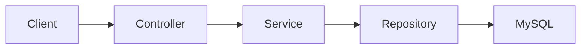

# Gestionale Spese — Backend API

Backend Spring Boot del progetto full stack **Gestionale Spese**. L'obiettivo è fornire una REST API persistente per la gestione di spese, entrate e movimenti personali.

- [Repository frontend](https://github.com/fabiozagaria/expense-tracker-angular)
- [Demo frontend](https://gestionale-spese.vercel.app/)

## Stato del progetto

**In sviluppo — primo verticale API.**

Il dominio delle spese, la persistenza JPA e il primo endpoint di lettura sono presenti. Il controller espone attualmente soltanto l'elenco delle spese; DTO e metodi service per creazione, sostituzione completa e aggiornamento parziale sono in lavorazione e non costituiscono ancora un CRUD REST completo.

## Implementato

- progetto Spring Boot 4.1 con Java 21;
- entità JPA `Expense` con importo `BigDecimal`, descrizione, categoria e data;
- categorie di spesa tramite `ExpenseCategory` salvate come stringhe;
- persistenza con Spring Data JPA e `ExpenseRepository`;
- DTO separati per creazione, PUT, PATCH e risposta;
- `ExpenseService` con lettura, mapping DTO/entity e primi metodi transazionali;
- `GET /api/expenses` per recuperare l'elenco delle spese;
- connessione MySQL configurabile tramite variabile d'ambiente;
- serializzazione delle date ISO con Jackson;
- strutture iniziali per eccezioni ed error handling;
- test di avvio del contesto Spring.

## Modello attuale

| Campo | Tipo | Note |
| --- | --- | --- |
| `id` | `Long` | Chiave primaria generata dal database |
| `title` | `String` | Obbligatorio e validato |
| `amount` | `BigDecimal` | Importo positivo |
| `description` | `String` | Descrizione facoltativa con lunghezza limitata |
| `category` | `ExpenseCategory` | Enum persistito come stringa |
| `date` | `LocalDate` | Data del movimento |

## Tecnologie

- Java 21
- Spring Boot 4.1
- Spring Web MVC
- Spring Data JPA
- Jakarta Validation
- Jackson
- MySQL
- Maven Wrapper

## Architettura attuale



## Stato degli endpoint REST

| Metodo | Endpoint | Stato |
| --- | --- | --- |
| `GET` | `/api/expenses` | Implementato |
| `GET` | `/api/expenses/{id}` | Da esporre |
| `POST` | `/api/expenses` | Service/DTO in lavorazione, endpoint non esposto |
| `PUT` | `/api/expenses/{id}` | Service/DTO in lavorazione, endpoint non esposto |
| `PATCH` | `/api/expenses/{id}` | Service/DTO in lavorazione, endpoint non esposto |
| `DELETE` | `/api/expenses/{id}` | Da implementare |

## Configurazione locale

### Requisiti

- JDK 21
- MySQL

Il progetto usa il database `expense-tracker`. La password viene letta dalla variabile d'ambiente `DB_PASSWORD`.

Esempio di preparazione del database:

```sql
CREATE DATABASE `expense-tracker`;
```

Linux e macOS:

```bash
export DB_PASSWORD="la-tua-password"
./mvnw spring-boot:run
```

Windows PowerShell:

```powershell
$env:DB_PASSWORD="la-tua-password"
./mvnw.cmd spring-boot:run
```

Il servizio userà `http://localhost:8080`.

## Verifiche

```bash
./mvnw test
```

Al momento è presente principalmente il test di caricamento del contesto; i test comportamentali devono ancora essere aggiunti.

## Prossimi sviluppi

1. rifinire il contratto dei DTO e le regole del dominio `Expense`;
2. completare mapping, validazione ed error handling;
3. esporre GET per id, POST, PUT, PATCH e DELETE nel controller;
4. aggiungere test JUnit/Mockito per service e controller;
5. configurare CORS e ambienti senza credenziali nel repository;
6. collegare l'intero verticale al frontend;
7. introdurre in seguito autenticazione e autorizzazione.

## Autore

Fabio Zagaria — Junior Backend Developer con competenze full stack.
