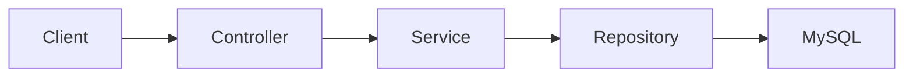

# Gestionale Spese — Backend API

Backend Spring Boot del progetto full stack **Gestionale Spese**. L'obiettivo è fornire una REST API persistente per la gestione di spese, entrate e movimenti personali.

- [Repository frontend](https://github.com/fabiozagaria/expense-tracker-angular)
- [Demo frontend](https://gestionale-spese.vercel.app/)

## Stato del progetto

**In sviluppo — CRUD delle spese completato.**

Il dominio `Expense` espone le operazioni di lettura, creazione, sostituzione, aggiornamento parziale ed eliminazione. La pubblicazione dell'API, l'integrazione completa con il frontend, entrate, utenti e autenticazione restano in evoluzione.

## Implementato

- progetto Spring Boot 4.1 con Java 21;
- entità JPA `Expense` con importo `BigDecimal`, descrizione, categoria e data;
- categorie di spesa tramite `ExpenseCategory` salvate come stringhe;
- persistenza con Spring Data JPA, `ExpenseRepository` ed `EntityManager`;
- DTO separati per creazione, PUT, PATCH e risposta;
- CRUD REST completo sotto `/api/expenses`;
- validazione dei payload con Jakarta Validation;
- metodi transazionali per creazione, modifica ed eliminazione;
- gestione dell'assenza di una spesa tramite eccezione dedicata;
- connessione MySQL configurabile tramite variabile d'ambiente;
- serializzazione delle date ISO con Jackson;
- test di avvio del contesto Spring.

## Modello attuale

| Campo | Tipo | Note |
| --- | --- | --- |
| `id` | `Long` | Chiave primaria generata dal database |
| `title` | `String` | Obbligatorio e validato |
| `amount` | `BigDecimal` | Importo positivo |
| `description` | `String` | Descrizione facoltativa con lunghezza limitata |
| `category` | `ExpenseCategory` | Enum persistito come stringa |
| `date` | `LocalDate` | Data del movimento |

## Tecnologie

- Java 21
- Spring Boot 4.1
- Spring Web MVC
- Spring Data JPA
- Jakarta Validation
- Jackson
- MySQL
- Maven Wrapper

## Architettura attuale



## Stato degli endpoint REST

| Metodo | Endpoint | Stato |
| --- | --- | --- |
| `GET` | `/api/expenses` | Implementato |
| `GET` | `/api/expenses/{id}` | Implementato |
| `POST` | `/api/expenses` | Implementato |
| `PUT` | `/api/expenses/{id}` | Implementato |
| `PATCH` | `/api/expenses/{id}` | Implementato |
| `DELETE` | `/api/expenses/{id}` | Implementato |

## Configurazione locale

### Requisiti

- JDK 21
- MySQL

Il progetto usa il database `expense-tracker`. La password viene letta dalla variabile d'ambiente `DB_PASSWORD`.

Esempio di preparazione del database:

```sql
CREATE DATABASE `expense-tracker`;
```

Linux e macOS:

```bash
export DB_PASSWORD="la-tua-password"
./mvnw spring-boot:run
```

Windows PowerShell:

```powershell
$env:DB_PASSWORD="la-tua-password"
./mvnw.cmd spring-boot:run
```

Il servizio userà `http://localhost:8080`.

## Verifiche

```bash
./mvnw test
```

Al momento è presente principalmente il test di caricamento del contesto; i test comportamentali devono ancora essere aggiunti.

## Limiti attuali

- l'API non è ancora pubblicata;
- la configurazione CORS è limitata all'ambiente Angular locale;
- il dominio delle entrate e la gestione utenti non sono completi;
- autenticazione e autorizzazione non sono ancora implementate;
- mancano test unitari e di integrazione sul comportamento del CRUD.

## Prossimi sviluppi

1. aggiungere test JUnit/Mockito per service e controller;
2. consolidare validazione ed error handling;
3. configurare CORS e ambienti per sviluppo e produzione;
4. collegare l'intero verticale al frontend;
5. introdurre entrate, utenti, autenticazione e autorizzazione.

## Autore

Fabio Zagaria — Junior Backend Developer con competenze full stack.
