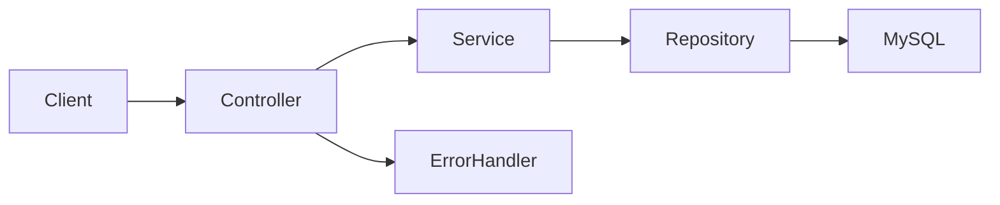

# Gestionale Spese — Backend API

Backend Spring Boot del progetto full stack **Gestionale Spese**. L'obiettivo è fornire una REST API persistente per la gestione di spese, entrate e movimenti personali.

- [Repository frontend](https://github.com/fabiozagaria/expense-tracker-angular)
- [Demo frontend](https://gestionale-spese.vercel.app/)

## Stato del progetto

**In sviluppo — struttura iniziale.**

Il dominio delle spese, il repository JPA e la configurazione MySQL sono presenti. Controller, service, gestione degli errori ed endpoint REST sono ancora da implementare: il backend non è ancora utilizzabile dal frontend come API completa.

## Implementato

- progetto Spring Boot 4.1 con Java 21;
- entità JPA `Expense`;
- categorie di spesa tramite `ExpenseCategory`;
- persistenza predisposta con Spring Data JPA;
- `ExpenseRepository` basato su `JpaRepository`;
- connessione MySQL configurabile tramite variabile d'ambiente;
- serializzazione delle date ISO con Jackson;
- strutture iniziali per controller, service ed error handling;
- test di avvio del contesto Spring.

## Modello attuale

| Campo      | Tipo              | Note                                  |
| ---------- | ----------------- | ------------------------------------- |
| `id`       | `Integer`         | Chiave primaria generata dal database |
| `title`    | `String`          | Obbligatorio tramite `@NotBlank`      |
| `amount`   | `BigDecimal`      | Importo della spesa                   |
| `category` | `ExpenseCategory` | Categoria della spesa                 |
| `date`     | `LocalDate`       | Data del movimento                    |

## Tecnologie

- Java 21
- Spring Boot 4.1
- Spring Web MVC
- Spring Data JPA
- Jakarta Validation
- Jackson
- MySQL
- Maven Wrapper

## Architettura prevista



## Contratto REST obiettivo

Gli endpoint seguenti rappresentano il contratto da implementare e allineare con il frontend:

| Metodo   | Endpoint             | Descrizione            |
| -------- | -------------------- | ---------------------- |
| `GET`    | `/api/expenses`      | Elenco delle spese     |
| `GET`    | `/api/expenses/{id}` | Dettaglio di una spesa |
| `POST`   | `/api/expenses`      | Creazione              |
| `PUT`    | `/api/expenses/{id}` | Aggiornamento completo |
| `PATCH`  | `/api/expenses/{id}` | Aggiornamento parziale |
| `DELETE` | `/api/expenses/{id}` | Eliminazione           |

> Questi endpoint non sono ancora esposti dall'attuale `ExpenseController`.

## Configurazione locale

### Requisiti

- JDK 21
- MySQL

Il progetto usa il database `expense-tracker`. La password viene letta dalla variabile d'ambiente `DB_PASSWORD`.

Esempio di preparazione del database:

```sql
CREATE DATABASE `expense-tracker`;
```

Linux e macOS:

```bash
export DB_PASSWORD="la-tua-password"
./mvnw spring-boot:run
```

Windows PowerShell:

```powershell
$env:DB_PASSWORD="la-tua-password"
./mvnw.cmd spring-boot:run
```

Il servizio userà `http://localhost:8080`.

## Verifiche

```bash
./mvnw test
```

## Prossimi sviluppi

1. definire DTO di richiesta e risposta allineati al frontend, incluso il campo `description`;
2. completare validazioni di importo, categoria e data;
3. salvare le categorie come stringhe nel database;
4. implementare service e CRUD REST;
5. aggiungere eccezioni applicative e un modello `APIError` completo;
6. configurare CORS e ambienti senza credenziali nel repository;
7. aggiungere test di repository, service e controller;
8. introdurre in seguito autenticazione e autorizzazione.

## Autore

Fabio Zagaria — Junior Backend Developer con competenze full stack.
