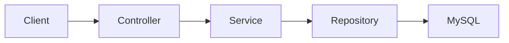

# Gestionale Spese — Backend API


**Versione attuale: 0.3.0-SNAPSHOT — API spese, entrate e riepilogo in consolidamento.**

Backend Spring Boot del progetto full stack **Gestionale Spese**. La versione corrente fornisce API persistenti per le spese personali, la creazione e lettura delle entrate e un riepilogo dei totali per utente.

- [Repository frontend](https://github.com/fabiozagaria/expense-tracker-angular)
- [Demo frontend](https://gestionale-spese.vercel.app/)

## Stato del progetto

**In consolidamento — CRUD spese e autenticazione coperti da test di integrazione; entrate e dashboard presenti nel codice, da verificare nel percorso completo.**

Il dominio `Expense` espone le operazioni di lettura, creazione, sostituzione, aggiornamento parziale ed eliminazione per l'utente autenticato. Registrazione con verifica email, BCrypt, login JWT, refresh token ruotato in cookie HttpOnly e logout sono coperti da un test di integrazione con MySQL e invio email simulato. La prova manuale nel browser e la pubblicazione dell'API restano aperte.

## Scopo e confine della versione

Expense Tracker è il prodotto full stack di riferimento per API MVC, DTO, validazione, transazioni, autenticazione e isolamento dei dati. Il prossimo traguardo è verificare insieme backend e frontend nel browser, includendo spese, entrate e riepilogo, prima di ampliare le funzionalità.

La presenza di endpoint e test nel repository è distinta dalla verifica dell'intero flusso distribuito.

## Implementato

- progetto Spring Boot 4.1 con Java 21;
- entità JPA `Expense` con importo `BigDecimal`, descrizione, categoria e data;
- categorie di spesa tramite `ExpenseCategory` salvate come stringhe;
- persistenza con Spring Data JPA, `ExpenseRepository` ed `EntityManager`;
- DTO separati per creazione, PUT, PATCH e risposta;
- CRUD REST completo sotto `/api/expenses`;
- validazione dei payload con Jakarta Validation;
- metodi transazionali per creazione, modifica ed eliminazione;
- gestione dell'assenza di una spesa tramite eccezione dedicata;
- connessione MySQL configurabile tramite variabile d'ambiente;
- serializzazione delle date ISO con Jackson;
- test di avvio del contesto Spring.
- registrazione, verifica email, login, refresh e logout sotto `/auth`;
- JWT Bearer per `/api/expenses`, isolamento delle spese per proprietario e CORS per il frontend locale;
- test di integrazione del flusso autenticazione e spese personali;
- `GET` e `POST /api/incomes` per entrate associate all'utente autenticato;
- `GET /api/dashboard/summary` per totale entrate, totale spese e saldo.

## Modello attuale

| Campo | Tipo | Note |
| --- | --- | --- |
| `id` | `Long` | Chiave primaria generata dal database |
| `title` | `String` | Obbligatorio e validato |
| `amount` | `BigDecimal` | Importo positivo |
| `description` | `String` | Descrizione facoltativa con lunghezza limitata |
| `category` | `ExpenseCategory` | Enum persistito come stringa |
| `date` | `LocalDate` | Data del movimento |

## Tecnologie

- Java 21
- Spring Boot 4.1
- Spring Web MVC
- Spring Data JPA
- Jakarta Validation
- Jackson
- MySQL
- Maven Wrapper

## Architettura attuale


```mermaid
flowchart LR
    Client --> Controller
    Controller --> Service
    Service --> Repository
    Repository --> MySQL
```

## Stato degli endpoint REST

| Metodo | Endpoint | Stato |
| --- | --- | --- |
| `GET` | `/api/expenses` | Implementato |
| `GET` | `/api/expenses/{id}` | Implementato |
| `POST` | `/api/expenses` | Implementato |
| `PUT` | `/api/expenses/{id}` | Implementato |
| `PATCH` | `/api/expenses/{id}` | Implementato |
| `DELETE` | `/api/expenses/{id}` | Implementato |

### Entrate e riepilogo

| Metodo | Endpoint | Comportamento presente |
| --- | --- | --- |
| `GET` | `/api/incomes` | Elenco entrate del proprietario |
| `POST` | `/api/incomes` | Creazione entrata |
| `GET` | `/api/dashboard/summary` | Totali e saldo del proprietario |

Il dominio entrate non espone ancora un CRUD completo. Questi endpoint richiedono autenticazione Bearer e non sono coperti dal test `AuthExpenseFlowTests` dedicato alle spese.

Gli endpoint `/api/expenses` richiedono `Authorization: Bearer <access token>` e restituiscono solo le spese dell'utente autenticato. Gli endpoint pubblici `POST /auth/register`, `/auth/verify-email`, `/auth/login`, `/auth/refresh` e `/auth/logout` gestiscono la sessione; il refresh token viaggia solo nel cookie HttpOnly.

## Configurazione locale

### Requisiti

- JDK 21 per l'avvio senza Docker
- MySQL per l'avvio senza Docker

Il progetto usa il database `expense-tracker`. La password viene letta dalla variabile d'ambiente `DB_PASSWORD`.

Esempio di preparazione del database:

```sql
CREATE DATABASE `expense-tracker`;
```

Linux e macOS:

```bash
export DB_PASSWORD="la-tua-password"
./mvnw spring-boot:run
```

Windows PowerShell:

```powershell
$env:DB_PASSWORD="la-tua-password"
./mvnw.cmd spring-boot:run
```

Per l'autenticazione serve anche `SECRET_KEY` (chiave casuale di almeno 32 byte, da impostare nell'ambiente e mai versionare). Il servizio userà `http://localhost:8080` e accetta il frontend locale su `http://localhost:4200`.

### Avvio con Docker Compose

1. Copiare `.env.example` in `.env` e compilare `DB_PASSWORD`, `MYSQL_ROOT_PASSWORD` e `SECRET_KEY` con valori propri. `.env` è ignorato da Git e dal contesto Docker.
2. Avviare lo stack con `docker compose up --build -d`.
3. Aprire Mailpit su `http://localhost:8025` per leggere il link di verifica email; avviare Angular su `http://localhost:4200`.

Compose avvia backend, MySQL 8 e Mailpit. Il database usa un volume persistente e non espone la porta 3306 sull'host. Backend e Mailpit sono accessibili solo da `localhost`. Per fermare i container: `docker compose down` (il volume MySQL resta disponibile).

## Verifiche

```bash
./mvnw test
```

Sono presenti il test di avvio del contesto e un test di integrazione con MySQL per registrazione, verifica email, login, refresh, Bearer e isolamento delle spese. L'invio email è simulato nel test.

## Limiti attuali

- l'API non è ancora pubblicata;
- la configurazione CORS è limitata all'ambiente Angular locale;
- entrate e dashboard sono implementate in parte, ma richiedono test dedicati e verifica con il frontend;
- il percorso completo nel browser con Mailpit resta da verificare;
- restano da ampliare i test dei casi limite del CRUD e configurare cookie/CORS/URL per la produzione.

## Prossimi sviluppi

1. verificare registrazione, verifica email, login, refresh e logout nel browser con Angular e Mailpit;
2. verificare spese, entrate, riepilogo e isolamento fra utenti, includendo modifiche ed eliminazioni;
3. aggiungere test mirati sui casi limite e sui nuovi endpoint;
4. configurare CORS, cookie e URL per gli ambienti e aggiornare la documentazione;
5. dopo questo traguardo, scegliere un solo incremento: per esempio filtri/paginazione oppure report mensile.

La configurazione attuale disabilita CSRF e usa il refresh cookie con `SameSite=Strict`: prima della pubblicazione va rivalutata rispetto alle origini e al flusso effettivi. Il logout revoca il refresh; un access token già emesso resta valido fino alla scadenza.

## Versioning

Il backend segue la stessa versione funzionale del frontend:

- `0.3.0-SNAPSHOT` identifica lo sviluppo della release Expense Tracker `0.3.0`;
- `PATCH` per correzioni compatibili;
- `MINOR` per nuove funzionalità durante la fase `0.x`;
- rimozione del suffisso `SNAPSHOT` quando viene prodotto un artefatto di release.

## Autore

Fabio Zagaria — Junior Backend Developer con competenze full stack.
